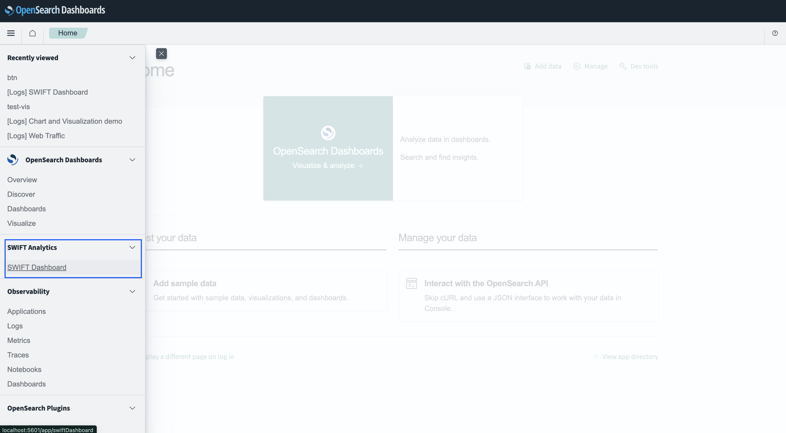
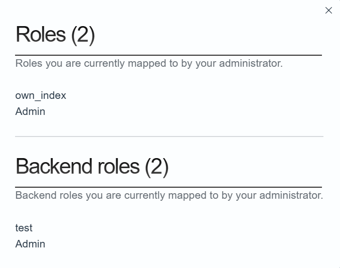

# SWIFT Analytics Dashboard

A comprehensive OpenSearch-based dashboard for monitoring and analyzing SWIFT MT/MX message translations. This dashboard provides real-time analytics, error analysis, and transaction monitoring across all integration patterns.

## 🌟 Dashboard Features

- **Real-time Monitoring**: Live message processing statistics and status
- **Message Analytics**: Transaction volume analysis and success rates
- **Error Analysis**: Categorized error reporting with drill-down capabilities
- **Currency Insights**: Transaction breakdown by currency with trending
- **Performance Metrics**: Processing times, throughput, and performance analysis
- **Advanced Search**: Full-text search across all message content
- **Visual Reports**: Interactive charts, graphs, and trend analysis
- **Role-based Access**: Federated authentication with OIDC support


##  Get Started Now

**🚀 Production Ready? Use the pre-built dashboard plugin:**

[](https://github.com/wso2/reference-implementation-cbpr/releases/latest)

**💡 Only need OpenSearch 2.19.0+ and basic setup!**

```bash
# Quick setup (Coming Soon - Plugin will be included in releases)
# 1. Download OpenSearch + Dashboards and Fluent-bit
# 2. Extract dashboard plugin from release
# 3. Install plugin
# 4. Configure and run
```
---

## 🏗️ Architecture

```
┌─────────────────────┐    ┌─────────────────────┐    ┌───────────────────────────┐
│   Integration       │───▶│     OpenSearch      │───▶│   Dashboard UI            │
│   JSON Logs         │    │     Indexing        │    │   (React Plugin)          │
├─────────────────────┤    ├─────────────────────┤    ├───────────────────────────┤
│ • FTP/SFTP          │    │ • Message Index     │    │ • Analytics Views         │
│ • MQ (planned)      │    │ • Log Index         │    │ • Search Interface        │
│ • REST (planned)    │    │                     │    │ • Translation comparison  │
│                     │    │                     │    │ • Log monitoring          │
└─────────────────────┘    └─────────────────────┘    └───────────────────────────┘
```

## 🚀 Quick Start

### Production Deployment (Recommended)

**Prerequisites:**
- Java 17+ (for OpenSearch runtime)
- Linux/macOS/Windows 10+ (supported platforms)
- Minimum 4GB RAM (for stable operation)
- Network access to download OpenSearch

**Setup Steps:**

1. **Download OpenSearch Stack**
   ```bash
   # Download OpenSearch 2.19.0
   wget https://artifacts.opensearch.org/releases/bundle/opensearch/2.19.0/opensearch-2.19.0-linux-x64.tar.gz
   tar -xzf opensearch-2.19.0-linux-x64.tar.gz
   
   # Download OpenSearch Dashboards 2.19.0
   wget https://artifacts.opensearch.org/releases/bundle/opensearch-dashboards/2.19.0/opensearch-dashboards-2.19.0-linux-x64.tar.gz
   tar -xzf opensearch-dashboards-2.19.0-linux-x64.tar.gz
   ```

2. **Configure OpenSearch for Production**
   ```bash
   cd opensearch-2.19.0
   nano config/opensearch.yml
   ```
   
   Basic production configuration:
   ```yaml
   ########################### Cluster ###########################
   cluster.name: opensearch-prod-cluster
   
   ############################ Node #############################
   node.name: node-1
   node.roles: [data, master, ingest]
   
   ########################## Network ############################
   network.host: 0.0.0.0  # Or better: ["_eth0_", "_local_"]
   http.port: 9200
   
   ########################### Discovery #########################
   discovery.seed_hosts: ["node-1.internal", "node-2.internal", "node-3.internal"]
   cluster.initial_master_nodes: ["node-1", "node-2", "node-3"]
   
   ######################### Path Settings #######################
   path.data: /var/lib/opensearch
   path.logs: /var/log/opensearch
   
   ######################### Security ############################
   plugins.security.disabled: false
   plugins.security.ssl.transport.enabled: true
   plugins.security.ssl.transport.pemcert_filepath: node-1.pem
   plugins.security.ssl.transport.pemkey_filepath: node-1-key.pem
   plugins.security.ssl.transport.pemtrustedcas_filepath: root-ca.pem
   plugins.security.ssl.transport.enforce_hostname_verification: false
   
   plugins.security.ssl.http.enabled: true
   plugins.security.ssl.http.pemcert_filepath: node-1.pem
   plugins.security.ssl.http.pemkey_filepath: node-1-key.pem
   plugins.security.ssl.http.pemtrustedcas_filepath: root-ca.pem
   
   plugins.security.allow_default_init_securityindex: true
   
   ########################### Authentication ####################
   plugins.security.authcz.admin_dn:
   - "CN=admin,OU=SSL,O=Test,L=Test,C=DE"
   
   plugins.security.nodes_dn:
   - "CN=node-1,OU=SSL,O=Test,L=Test,C=DE"
   - "CN=node-2,OU=SSL,O=Test,L=Test,C=DE"
   - "CN=node-3,OU=SSL,O=Test,L=Test,C=DE"
   
   ########################### Performance #######################
   bootstrap.memory_lock: true
   indices.query.bool.max_clause_count: 10240
   action.destructive_requires_name: true
   ```

3. **Configure OpenSearch Dashboards**
   ```bash
   cd opensearch-dashboards-2.19.0
   nano config/opensearch_dashboards.yml
   ```
   
   Basic configuration:
   ```yaml
   ########################## OpenSearch Connection ##########################
   opensearch.hosts: ["https://opensearch-node1.example.com:9200"]
   opensearch.ssl.verificationMode: full  # full = verify cert and hostname
   opensearch.username: "kibanaserver"
   opensearch.password: "your-secure-password"
   opensearch.requestHeadersWhitelist: [authorization, securitytenant]
   
   ########################## Server Settings ###############################
   server.host: "0.0.0.0"  # Or set to internal IP/domain
   server.port: 5601
   server.ssl.enabled: true
   server.ssl.certificate: /etc/opensearch-dashboards/certs/dashboards.pem
   server.ssl.key: /etc/opensearch-dashboards/certs/dashboards-key.pem
   
   ########################## Security Plugin ###############################
   opensearch_security.multitenancy.enabled: true
   opensearch_security.multitenancy.tenants.preferred: [Private, Global]
   opensearch_security.readonly_mode.roles: ["kibana_read_only"]
   
   # Make sure cookies are secure in production
   opensearch_security.cookie.secure: true
   
   ########################## Logging (Optional) #############################
   logging.dest: /var/log/opensearch-dashboards/opensearch-dashboards.log
   logging.verbose: false
   ```


4. **Edit kernel settings to increase the number of memory maps available to OpenSearch.**

   Edit the sysctl config file that defines the host’s max map count:

   ```
   sudo vi /etc/sysctl.conf
   ```

   Set max map count to the recommended value of `262144`:

   ```
   vm.max_map_count=262144
   ```

   Reload the kernel parameters:

   ```
    sudo sysctl -p
   ```
   
5. **Start Services**
   ```bash
   # Start OpenSearch (in background)
   cd opensearch-2.19.0
   bin/opensearch.sh
   
   # Start OpenSearch Dashboards
   cd opensearch-dashboards-2.19.0
   bin/opensearch-dashboards.sh
   ```

6. **Access OpenSearch Dashboards**
   ```
   http://localhost:5601/
   ```
   
7. **Install SWIFT Analytics Dashboard Plugin**
   ```bash
   # Download the latest release: 
   https://github.com/wso2/reference-implementation-cbpr/releases/latest)
   
   # Install the plugin:
   bin/opensearch-dashboards-plugin install file:///path/to/swift-dashboard-plugin.zip
   ```
   Once installed, launch OpenSearch Dashboards. Your plugin should appear on the left-hand panel.

   

8. **Configure Fluent Bit for Log Ingestion**

   Fluent Bit is used to collect and forward logs from the SWIFT translator services to OpenSearch for dashboard analytics.

   **Download and Install Fluent Bit:**
   ```bash
   # Linux (Ubuntu/Debian)
   curl https://raw.githubusercontent.com/fluent/fluent-bit/master/install.sh | sh
   
   # Or download from: https://fluentbit.io/download/
   # Extract and install according to your platform
   ```
   
   **Create Fluent Bit Parsers Configuration (`parsers.conf`):**
   ```ini
   [PARSER]
       Name        docker
       Format      json
       Time_Key    time
       Time_Format %Y-%m-%dT%H:%M:%S %z

   [PARSER]
       Name        ballerina_json_parser
       Format      json
       Time_Key    time                # The field in your JSON containing the timestamp
       Time_Format %Y-%m-%dT%H:%M:%S.%L%z # The format of that timestamp string
       Time_Keep   On                  # Keep the original 'time' field
   
   [PARSER]
       Name   json
       Format json
       Time_Key time
       Time_Format %d/%b/%Y:%H:%M:%S %z
   ```

   **Create Fluent Bit Configuration (`fluent-bit.conf`):**
   ```ini
   [SERVICE]
       flush        1
       daemon       Off
       log_level    info
       parsers_file parsers.conf <path to parsers.conf>
       plugins_file /usr/local/Cellar/fluent-bit/4.0.3/etc/fluent-bit/plugins.conf <path to plugins.conf>
       http_server  Off
       http_listen  0.0.0.0
       http_port    2020
       storage.metrics on

   [INPUT]
       Name             tail
       Tag              mtmx
       Path             /logs/dashboard*.log <path to dashboard logs>
       Parser           json
       Refresh_Interval 1
       exit_on_eof      off

   [OUTPUT]
      Name            opensearch
      Match           mtmx
      Host            localhost
      Port            9200
      HTTP_User       admin <opensearch username>
      HTTP_Passwd     Pass@123@pass <opensearch password>
      Index           translated_log
      Suppress_Type_Name On
      Logstash_Format Off
      Time_Key        @timestamp
      Generate_ID     On
      tls             Off
      tls.verify      Off
   
   [INPUT]
      Name             tail
      Tag              logs
      Path             /logs/ballerina*.log <path to ballerina logs>
      Parser           ballerina_json_parser
      Refresh_Interval 1
      exit_on_eof      off
   
   [OUTPUT]
      Name            opensearch
      Match           logs
      Host            localhost
      Port            9200
      HTTP_User       admin <opensearch username>
      HTTP_Passwd     Pass@123@pass <opensearch password>
      Index           ballerina_log
      Suppress_Type_Name On
      Logstash_Format Off
      Time_Key        time
      Generate_ID     On
      tls             Off
      tls.verify      Off
   ```

   **Start Fluent Bit:**
   ```bash
   # Start Fluent Bit with configuration
   fluent-bit -c /path/to/fluent-bit.conf

   # Or as a service (systemd)
   sudo systemctl start fluent-bit
   sudo systemctl enable fluent-bit
   ```

   **Verify Log Ingestion:**
   ```bash
   # Check Fluent Bit metrics
   curl http://localhost:2020/api/v1/metrics

   # Check OpenSearch indices
   curl -X GET "localhost:9200/_cat/indices/swift-*?v&s=index"

   # Sample query to verify logs are being indexed
   curl -X GET "localhost:9200/swift-logs/_search?pretty" \
        -H 'Content-Type: application/json' \
        -d '{"query": {"match_all": {}}, "size": 5}'
   ```

   **Create Index Templates (Recommended):**

   Set up index templates for better log management:

   ```bash
   # Create template for translator logs
   curl -X PUT "localhost:9200/_index_template/swift-translator-logs" \
        -H 'Content-Type: application/json' \
        -d '{
     "index_patterns": ["swift-translator-logs-*"],
     "template": {
       "settings": {
         "number_of_shards": 1,
         "number_of_replicas": 1,
         "index.lifecycle.name": "swift-logs-policy",
         "index.lifecycle.rollover_alias": "swift-translator-logs"
       },
       "mappings": {
         "properties": {
           "timestamp": {"type": "date"},
           "level": {"type": "keyword"},
           "message": {"type": "text"},
           "service": {"type": "keyword"},
           "environment": {"type": "keyword"},
           "component": {"type": "keyword"},
           "file_path": {"type": "keyword"}
         }
       }
     }
   }'
   ```

   **Index Lifecycle Management (Optional):**

   Set up automatic log rotation and cleanup:

   ```bash
   # Create ILM policy for log retention
   curl -X PUT "localhost:9200/_ilm/policy/swift-logs-policy" \
        -H 'Content-Type: application/json' \
        -d '{
     "policy": {
       "phases": {
         "hot": {
           "actions": {
             "rollover": {
               "max_size": "1GB",
               "max_age": "1d"
             }
           }
         },
         "warm": {
           "min_age": "7d",
           "actions": {
             "shrink": {
               "number_of_shards": 1
             }
           }
         },
         "delete": {
           "min_age": "30d"
         }
       }
     }
   }'
   ```

   **Troubleshooting Fluent Bit:**

   Common issues and solutions:

   ```bash
   # Check Fluent Bit logs
   tail -f /var/log/fluent-bit.log

   # Test configuration
   fluent-bit -c /path/to/fluent-bit.conf --dry-run

   # Check file permissions
   ls -la /path/to/swift/translator/logs/
   # Ensure fluent-bit user can read log files

   # Verify OpenSearch connectivity
   curl -u admin:password https://localhost:9200/_cluster/health
   ```

## 🔧 Build & Deploy (Advanced)

### Building Dashboard Plugin from Source

**Prerequisites for Building:**
- Node.js v20+ 
- Yarn package manager
- OpenSearch Dashboards 2.19.0 source (for development)
- Git (for source access)

**Build Steps:**

1. **Setup Development Environment**
   ```bash
   # Clone OpenSearch Dashboards source (required for plugin development)
   git clone https://github.com/opensearch-project/OpenSearch-Dashboards.git
   cd OpenSearch-Dashboards
   yarn osd bootstrap
   ```

2. **Clone Dashboard Plugin Source**
   ```bash
   cd plugins/
   git clone https://github.com/wso2/reference-implementation-cbpr.git
   cd reference-implementation-cbpr/dashboard/swift_dashboard/
   ```

3. **Build Plugin**
   ```bash
   # Install dependencies
   yarn install
   
   # Build for production
   yarn build
   
   # Plugin archive will be created in: build/swiftDashboard-2.19.0.zip
   ```

4. Follow the [Production Deployment](#production-deployment-recommended) steps to install the built plugin into OpenSearch Dashboards.

---

## 🔐 Authentication & Security

### Federated Login with Asgardeo

The dashboard supports OIDC-based authentication:

1. **Create Asgardeo Application**
   - Log in to the Asgardeo Console.
   - Navigate to **Applications** in the left menu.
   - Click "New Application".
   - Choose "Traditional Web Application".
   - Enter a name for your application (e.g., OpenSearch Federation).
   - Choose OpenId Connect
   - Enter the Redirect URL (http://localhost:5601/auth/openid/login)
   - Click "Create".


   

2. **Configure Protocol Settings**

      Once the app is created, configure OIDC protocol settings.

      - Go to the **Protocols** tab.
      - In the allowed origins section add the HTTP origins that host your OpenSearch application. (http://localhost:5601)
      - Enable the Hybrid Flow and select code id_token option under it. 
      - Choose JWT as the token type under Access Token section 
      - Add the Back channel logout URL in the Logout URLs section
       
      

3. **Configure User Attributes (Scopes)**

   Navigate to the **User Attributes** tab:

   - Under **Scopes**: 
     - Enable the **role** scope – this will expose the roles assigned to the user, allowing OpenSearch to map them.
     
   - Under **Subject Attribute**:
     - Set it to **username** – this will be used as the authenticated user's identity.
     

4. **Create Roles in Asgardeo**

   - Go to the **Roles** in the User Management section in the left panel.
   - Click **New Role**.
   - Enter a role name (e.g., OSAsgardeoAdmin).
   -  Choose role audience.
   - Choose the application to which the role should be assigned.
   - Select API Resource as Application Management API
   - Click **Finish**.

5. **Create Users in Asgardeo**

   - Go to **Users** in the User Management section in the left panel.
   - Click **Add User**.
   - Fill in user details.
   - Click **Finish**.

6. **Assign Roles to Users in Asgardeo**

   - Go to **Roles** in the User Management section in the left panel.
   - Select the role to be assigned.
   - Navigate to the **Users** section.
   - Click **Assign User**.
   - Select the user to be assigned.
   - Click **Save**.

7. **Configure OpenSearch**

   In OpenSearch navigate to the **opensearch-security** folder inside the **config** folder:

   - Navigate to **config.yml** and set the following OIDC parameters:
   
   ```yaml
   _meta:
      type: "config"
      config_version: 2
   config:
      dynamic:
         http:
            anonymous_auth_enabled: false
         authc:
            basic_internal_auth_domain:
               http_enabled: true
               transport_enabled: true
               order: 0
               http_authenticator:
                  type: basic
                  challenge: false
               authentication_backend:
                  type: internal
            openid_auth_domain:
              http_enabled: true
              transport_enabled: false
              order: 1
              http_authenticator:
                type: openid
                challenge: false
                config:
                  subject_key: sub
                  roles_key: roles
                  openid_connect_url: https://api.asgardeo.io/t/<org-name>/oauth2/token/.well-known/openid-configuration
                  jwt_header: Authorization
              authentication_backend:
                type: noop
   ```
   > Note: It is required to have basic_internal_auth_domain to connect OpenSearch Dashboards to OpenSearch.

   - Navigate to the **roles_mapping.yml** and define roles based on use case:
     
   ```yaml
   Admin:
     reserved: false
     hidden: false
     backend_roles:
       - "OSAsgardeoAdmin"
     users: []
     hosts: []
     and_backend_roles: []
     description: "Maps admin to all_access"
   ```

   - Navigate to the **roles.yml** and define permissions given to each roles based on use case:
   
   ```yaml
   Admin:
     reserved: false
     hidden: false
     cluster_permissions:
     - "cluster_monitor"
     - "read"
     - "indices:monitor/settings/get"
     index_permissions:
     - index_patterns: ["*"]
     allowed_actions: [
       "read",
       "indices_monitor",
       "indices:monitor/*",
       "index",
       "search"]
     tenant_permissions:
     - tenant_patterns: ["global tenant" ]
     allowed_actions: ["kibana_all_read"]
     static: false
   ```

8. **Apply configurations.**

   ```bash
   cd plugins\opensearch-security\tools
   securityadmin.sh -cacert ../../../config/root-ca.pem -cert ../../../config/kirk.pem -key ../../../config/kirk-key.pem -cd ../../../config/opensearch-security
   ```
   
9.  **Update OpenSearch Dashboards Configuration**

      Navigate to **opensearch_dashboards.yml** and set the following configurations:
   
      ```yaml
      opensearch_security.auth.type: "openid"
      opensearch_security.openid.header: "Authorization"
      opensearch_security.openid.connect_url: "https://api.asgardeo.io/t/<org-name>/oauth2/token/.well-known/openid-configuration"
      opensearch_security.openid.client_id: "client_id"
      opensearch_security.openid.client_secret: "client_secret"
      opensearch_security.openid.scope: "openid profile roles"
      opensearch_security.openid.base_redirect_url: "http://localhost:5601"
      opensearch_security.openid.logout_url: "https://api.asgardeo.io/t/<org-name>/oidc/logout"
      ```

   > Make sure to replace placeholders with actual values from your Asgardeo app.

10. **Test the Integration**

   - Restart OpenSearch Dashboards if needed.
   - Open OpenSearch Dashboards in a browser.
   - You should be redirected to Asgardeo for login.
   - Log in with a test user.
   - Verify that roles are passed and that access is granted accordingly. This can be done by clicking the profile and then clicking the "View roles and identities" where you will be able to see the role assigned for the logged in user.
   
   

## 📚 Additional Resources

- [OpenSearch Security Plugin](https://docs.opensearch.org/latest/security/)
- [Asgardeo OIDC Integration](https://wso2.com/asgardeo/docs/)

---
