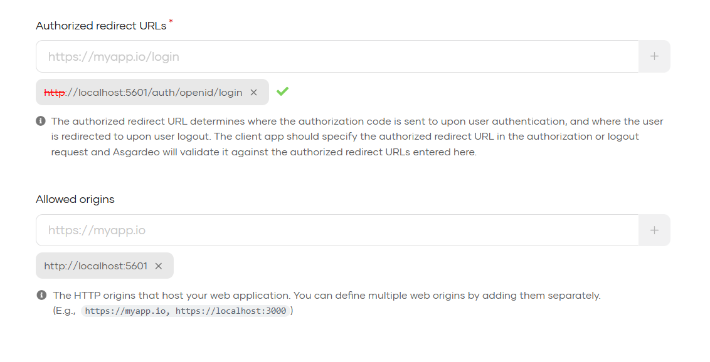
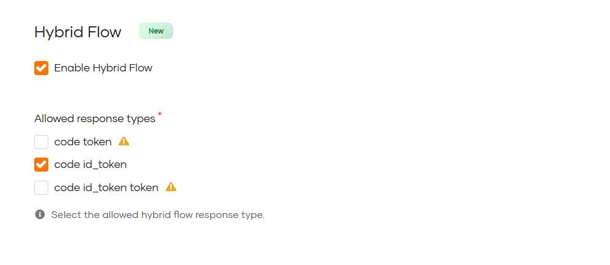

# SWIFT Dashboard Plugin for OpenSearch

An OpenSearch Dashboards plugin providing comprehensive analytics and monitoring for SWIFT MT/MX message translations. This plugin offers real-time insights into message processing, error analysis, and transaction monitoring.

## 🌟 Plugin Features

- **Real-time Analytics**: Live message processing statistics
- **Error Analysis**: Categorized error reporting and resolution tracking  
- **Transaction Monitoring**: Currency and amount analysis with trends
- **Advanced Search**: Full-text search across message content
- **Visual Reports**: Interactive charts and dashboards
- **Role-based Access**: Integrated with OpenSearch Security

## 📋 Table of Contents

1. [Development Setup](#development-setup)
2. [Production Deployment](#production-deployment) 
3. [Plugin Installation](#plugin-installation)
4. [Federated Authentication](#federated-authentication-oidc)
5. [Configuration Reference](#configuration-reference)
6. [Troubleshooting](#troubleshooting)

---

## Development Setup

### Prerequisites

- **Java 17+**: Required for OpenSearch runtime
- **Node.js v20**: Required for plugin development  
- **Windows 10/11** or **Linux/macOS**: Supported platforms
- **Minimum 4GB RAM**: For stable operation

### Step 1: Download OpenSearch (Version 2.19.0)

Visit the official OpenSearch download page: [https://opensearch.org/downloads/](https://opensearch.org/downloads/)

### Step 2: Download OpenSearch Dashboards (Version 2.19.0)

Visit the official OpenSearch Dashboards download page: [https://opensearch.org/downloads/#opensearch-dashboards](https://opensearch.org/downloads/#opensearch-dashboards)

### Step 3: Configure OpenSearch for Development

Edit `config/opensearch.yml`:

```yaml
# Development Configuration
cluster.name: opensearch-cluster
node.name: node-1
network.host: 0.0.0.0
http.port: 9200
discovery.seed_hosts: ["127.0.0.1"]
cluster.initial_master_nodes: ["node-1"]

# IMPORTANT: Only disable security for local development
plugins.security.disabled: true
```

### Step 4: Configure OpenSearch Dashboards for Development

Edit `config/opensearch_dashboards.yml`:

```yaml
# Development Configuration
opensearch.hosts: [http://localhost:9200]  # Note: HTTP for dev (security disabled)
opensearch.ssl.verificationMode: none
opensearch.requestHeadersWhitelist: [authorization, securitytenant]

# Server settings
server.host: "0.0.0.0"
server.port: 5601

# Security disabled for development
opensearch_security.cookie.secure: false
```

### Step 5: Start Services (Development)

**Windows:**
```bash
# Start OpenSearch
cd opensearch-2.19.0
bin\opensearch.bat

# Start OpenSearch Dashboards (in new terminal)
cd opensearch-dashboards-2.19.0  
bin\opensearch-dashboards.bat
```

**Linux/macOS:**
```bash
# Start OpenSearch
cd opensearch-2.19.0
bin/opensearch

# Start OpenSearch Dashboards (in new terminal)
cd opensearch-dashboards-2.19.0
bin/opensearch-dashboards
```

Access Dashboards at [http://localhost:5601](http://localhost:5601)

### Step 6: Plugin Development Setup

#### Clone OpenSearch Dashboards Source (for plugin development)

```bash
git clone https://github.com/opensearch-project/OpenSearch-Dashboards.git
cd OpenSearch-Dashboards
git checkout 2.19.0  # Match your dashboard version
```

#### Bootstrap Development Environment

```bash
yarn osd bootstrap
```

#### Install Plugin Dependencies

```bash
cd plugins/swift_dashboard  # Your plugin directory
yarn install
```

#### Development Commands

```bash
# Build plugin in development mode
yarn plugin:dev

# Build production plugin
yarn build

# Run tests
yarn test:server
yarn test:browser

# Lint code
yarn lint
```


## Production Deployment

### Step 1: Download OpenSearch & Dashboards

Download OpenSearch and OpenSearch Dashboards version 2.19.0 from [https://opensearch.org/downloads/](https://opensearch.org/downloads/)

### Step 2: Configure OpenSearch for Production

Edit `config/opensearch.yml`:

```yaml
########################### Cluster ###########################
cluster.name: opensearch-prod-cluster

############################ Node #############################
node.name: node-1
node.roles: [data, master, ingest]

########################## Network ############################
network.host: 0.0.0.0  # Or better: ["_eth0_", "_local_"]
http.port: 9200

########################### Discovery #########################
discovery.seed_hosts: ["node-1.internal", "node-2.internal", "node-3.internal"]
cluster.initial_master_nodes: ["node-1", "node-2", "node-3"]

######################### Path Settings #######################
path.data: /var/lib/opensearch
path.logs: /var/log/opensearch

######################### Security ############################
plugins.security.disabled: false
plugins.security.ssl.transport.enabled: true
plugins.security.ssl.transport.pemcert_filepath: node-1.pem
plugins.security.ssl.transport.pemkey_filepath: node-1-key.pem
plugins.security.ssl.transport.pemtrustedcas_filepath: root-ca.pem
plugins.security.ssl.transport.enforce_hostname_verification: false

plugins.security.ssl.http.enabled: true
plugins.security.ssl.http.pemcert_filepath: node-1.pem
plugins.security.ssl.http.pemkey_filepath: node-1-key.pem
plugins.security.ssl.http.pemtrustedcas_filepath: root-ca.pem

plugins.security.allow_default_init_securityindex: true

########################### Authentication ####################
plugins.security.authcz.admin_dn:
  - "CN=admin,OU=SSL,O=Test,L=Test,C=DE"

plugins.security.nodes_dn:
  - "CN=node-1,OU=SSL,O=Test,L=Test,C=DE"
  - "CN=node-2,OU=SSL,O=Test,L=Test,C=DE"
  - "CN=node-3,OU=SSL,O=Test,L=Test,C=DE"

########################### Performance #######################
bootstrap.memory_lock: true
indices.query.bool.max_clause_count: 10240
action.destructive_requires_name: true
```

### Step 3: Configure OpenSearch Dashboards for Production

Edit `config/opensearch_dashboards.yml`:

```yaml
########################## OpenSearch Connection ##########################
opensearch.hosts: ["https://opensearch-node1.example.com:9200"]
opensearch.ssl.verificationMode: full  # full = verify cert and hostname
opensearch.username: "kibanaserver"
opensearch.password: "your-secure-password"
opensearch.requestHeadersWhitelist: [authorization, securitytenant]

########################## Server Settings ###############################
server.host: "0.0.0.0"  # Or set to internal IP/domain
server.port: 5601
server.ssl.enabled: true
server.ssl.certificate: /etc/opensearch-dashboards/certs/dashboards.pem
server.ssl.key: /etc/opensearch-dashboards/certs/dashboards-key.pem

########################## Security Plugin ###############################
opensearch_security.multitenancy.enabled: true
opensearch_security.multitenancy.tenants.preferred: [Private, Global]
opensearch_security.readonly_mode.roles: ["kibana_read_only"]

# Make sure cookies are secure in production
opensearch_security.cookie.secure: true

########################## Logging (Optional) #############################
logging.dest: /var/log/opensearch-dashboards/opensearch-dashboards.log
logging.verbose: false
```

### Step 4: Start Services (Production)

**Linux/macOS (Systemd):**
```bash
# Start OpenSearch
sudo systemctl start opensearch
sudo systemctl enable opensearch

# Start OpenSearch Dashboards
sudo systemctl start opensearch-dashboards
sudo systemctl enable opensearch-dashboards
```

**Manual Start:**
```bash
# Start OpenSearch
cd opensearch-2.19.0
bin/opensearch -d  # -d for daemon mode

# Start OpenSearch Dashboards
cd opensearch-dashboards-2.19.0
bin/opensearch-dashboards &
```

## Plugin Installation

### Method 1: Install Pre-built Plugin

```bash
# Download the plugin zip from releases or build it yourself
# Install using the opensearch-dashboards-plugin utility

# Windows
bin\opensearch-dashboards-plugin.bat install file:///path/to/swiftDashboard-2.19.0.zip

# Linux/macOS  
bin/opensearch-dashboards-plugin install file:///path/to/swiftDashboard-2.19.0.zip
```

### Method 2: Build and Install from Source

#### Step 1: Prepare Plugin Structure

Ensure your plugin follows this structure:
```
swift_dashboard/
├── opensearch_dashboards.json     # Plugin metadata
├── package.json                   # Dependencies and scripts  
├── index.ts                       # Plugin entry point
├── public/                        # Frontend React components
│   ├── application.tsx            # Main application
│   ├── components/                # UI components
│   ├── services/                  # API services
│   └── types/                     # TypeScript definitions
└── server/                        # Backend API
    ├── index.ts                   # Server entry point
    ├── routes/                    # API routes
    └── services/                  # Business logic
```

#### Step 2: Build the Plugin

```bash
cd swift_dashboard/
yarn install
yarn build
```

#### Step 3: Install Built Plugin

```bash
# The build creates a zip file in the build directory
# Install it using the opensearch-dashboards-plugin utility

# Windows
cd /path/to/opensearch-dashboards-2.19.0
bin\opensearch-dashboards-plugin.bat install file:///path/to/swift_dashboard/build/swiftDashboard-2.19.0.zip

# Linux/macOS
cd /path/to/opensearch-dashboards-2.19.0  
bin/opensearch-dashboards-plugin install file:///path/to/swift_dashboard/build/swiftDashboard-2.19.0.zip
```

### Step 4: Verify Installation

1. Restart OpenSearch Dashboards
2. Open your browser and go to `http://localhost:5601`
3. Look for "SWIFT Dashboard" in the left navigation panel
4. Click to access the dashboard


### Plugin Configuration

The plugin metadata in `opensearch_dashboards.json`:

```json
{
  "id": "swiftDashboard",
  "version": "1.0.0", 
  "opensearchDashboardsVersion": "2.19.0",
  "server": true,
  "ui": true,
  "requiredPlugins": ["navigation"],
  "optionalPlugins": ["data", "savedObjects"]
}
```

### Updating the Plugin

To update an existing installation:

```bash
# Remove the old version
bin/opensearch-dashboards-plugin remove swiftDashboard

# Install the new version
bin/opensearch-dashboards-plugin install file:///path/to/new/swiftDashboard-2.19.0.zip

# Restart OpenSearch Dashboards
```


## Federated Authentication (OIDC)

This guide configures federated login for OpenSearch using OpenID Connect (OIDC) with [Asgardeo](https://wso2.com/asgardeo/).

### Prerequisites

- Working OpenSearch instance with security enabled
- Asgardeo account ([https://console.asgardeo.io/](https://console.asgardeo.io/))
- Administrator access to both Asgardeo and OpenSearch

### Step 1: Create Application in Asgardeo

1. Log in to the Asgardeo Console
2. Navigate to **"Applications"** → **"New Application"**  
3. Choose **"Traditional Web Application"**
4. Enter application name: `OpenSearch Federation`
5. Choose **OpenID Connect**
6. Set Redirect URL: `http://localhost:5601/auth/openid/login`
7. Click **"Create"**


### Step 2: Configure Protocol Settings

Under the **Protocol** tab:

1. **Allowed Origins**: Add `http://localhost:5601`
2. **Hybrid Flow**: Enable and select `code id_token`
3. **Access Token**: Choose JWT format
4. **Logout URLs**: Add back-channel logout URL




### Step 3: Configure User Attributes (Scopes)

Navigate to **"User Attributes"** tab:

1. **Enable Scopes**:
   - ✅ `role` scope (exposes user roles to OpenSearch)
   


2. **Subject Attribute**: Set to `username`


### Step 4: Create Roles in Asgardeo

1. Go to **"Roles"** in User Management
2. Click **"New Role"**
3. Create roles like: `os-admin`, `os-analyst`, `os-viewer`
4. Choose role audience and assign to application
5. Select API Resource as Application Management API

### Step 5: Create and Assign Users

1. **Create Users**: Go to **"Users"** → **"Add User"**
2. **Assign Roles**: Go to **"Roles"** → Select role → **"Users"** → **"Assign User"**

### Step 6: Configure OpenSearch

Edit `config/opensearch-security/config.yml`:

```yaml
_meta:
  type: "config"
  config_version: 2

config:
  dynamic:
    http:
      anonymous_auth_enabled: false
    authc:
      basic_internal_auth_domain:
        http_enabled: true
        transport_enabled: true
        order: 0
        http_authenticator:
          type: basic
          challenge: false
        authentication_backend:
          type: internal
      openid_auth_domain:
        http_enabled: true
        transport_enabled: false
        order: 1
        http_authenticator:
          type: openid
          challenge: false
          config:
            subject_key: sub
            roles_key: roles
            openid_connect_url: https://api.asgardeo.io/t/<org-name>/oauth2/token/.well-known/openid-configuration
            jwt_header: Authorization
        authentication_backend:
          type: noop
```

### Step 7: Configure Role Mapping

Edit `config/opensearch-security/roles_mapping.yml`:

```yaml
# Map Asgardeo roles to OpenSearch roles
swift_admin:
  reserved: false
  hidden: false
  backend_roles:
    - "os-admin"      # Role from Asgardeo
  users: []
  hosts: []
  and_backend_roles: []
  description: "Maps Asgardeo admin role to OpenSearch admin permissions"

swift_analyst:
  reserved: false
  hidden: false
  backend_roles:
    - "os-analyst"
  description: "Maps Asgardeo analyst role to read-only permissions"

swift_viewer:
  reserved: false
  hidden: false  
  backend_roles:
    - "os-viewer"
  description: "Maps Asgardeo viewer role to dashboard view only"
```

### Step 8: Define Role Permissions

Edit `config/opensearch-security/roles.yml`:

```yaml
# Admin role with full access
swift_admin:
  reserved: false
  hidden: false
  cluster_permissions:
    - "cluster_monitor"
    - "cluster_all"
  index_permissions:
    - index_patterns: ["*"]
      allowed_actions: ["indices_all"]
  tenant_permissions:
    - tenant_patterns: ["*"]
      allowed_actions: ["kibana_all_write"]

# Analyst role with read access
swift_analyst:
  reserved: false
  hidden: false
  cluster_permissions:
    - "cluster_monitor"
  index_permissions:
    - index_patterns: ["swift_messages*"]
      allowed_actions: ["read", "search"]
  tenant_permissions:
    - tenant_patterns: ["global_tenant"]
      allowed_actions: ["kibana_all_read"]

# Viewer role with dashboard access only
swift_viewer:
  reserved: false
  hidden: false
  cluster_permissions:
    - "cluster_monitor"
  index_permissions:
    - index_patterns: ["swift_messages*"]
      allowed_actions: ["read"]
  tenant_permissions:
    - tenant_patterns: ["global_tenant"]
      allowed_actions: ["kibana_all_read"]
```

### Step 9: Apply Security Configuration

Run the security admin script while OpenSearch is running:

```bash
cd opensearch-2.19.0/plugins/opensearch-security/tools

# Windows
securityadmin.bat -cacert ../../../config/root-ca.pem -cert ../../../config/kirk.pem -key ../../../config/kirk-key.pem -cd ../../../config/opensearch-security

# Linux/macOS
./securityadmin.sh -cacert ../../../config/root-ca.pem -cert ../../../config/kirk.pem -key ../../../config/kirk-key.pem -cd ../../../config/opensearch-security
```

### Step 10: Configure OpenSearch Dashboards

Edit `config/opensearch_dashboards.yml`:

```yaml
# OIDC Authentication Configuration
opensearch_security.auth.type: "openid"
opensearch_security.openid.header: "Authorization"
opensearch_security.openid.connect_url: "https://api.asgardeo.io/t/<org-name>/oauth2/token/.well-known/openid-configuration"
opensearch_security.openid.client_id: "your-client-id"
opensearch_security.openid.client_secret: "your-client-secret"  
opensearch_security.openid.scope: "openid profile roles"
opensearch_security.openid.base_redirect_url: "http://localhost:5601"
opensearch_security.openid.logout_url: "https://api.asgardeo.io/t/<org-name>/oidc/logout"

# Multi-tenancy settings
opensearch_security.multitenancy.enabled: true
opensearch_security.multitenancy.tenants.preferred: ["Private", "Global"]
```

### Step 11: Test Integration

1. Restart OpenSearch Dashboards
2. Open `http://localhost:5601`
3. You should be redirected to Asgardeo login
4. Login with test user
5. Verify role assignment in Profile → "View roles and identities"


### Troubleshooting OIDC

#### Common Issues:

1. **Redirect URI Mismatch**
   - Ensure Asgardeo redirect URL matches exactly: `http://localhost:5601/auth/openid/login`

2. **Role Not Appearing**
   - Verify `role` scope is enabled in Asgardeo
   - Check user has been assigned roles in Asgardeo
   - Confirm `roles_key: roles` in OpenSearch config

3. **SSL/Certificate Errors**
   - For development, use HTTP URLs
   - For production, ensure valid certificates

4. **Permission Denied**
   - Check role mapping in `roles_mapping.yml`
   - Verify role permissions in `roles.yml`
   - Run securityadmin script after changes

## Configuration Reference

### Plugin Configuration

The plugin expects specific index mappings and configurations in OpenSearch.

#### Index Template for SWIFT Messages

```json
PUT _index_template/swift_messages_template
{
  "index_patterns": ["swift_messages*"],
  "template": {
    "mappings": {
      "properties": {
        "id": { "type": "keyword" },
        "mtMessageType": { "type": "keyword" },
        "mxMessageType": { "type": "keyword" },
        "currency": { "type": "keyword" },
        "amount": { "type": "double" },
        "date": { "type": "date" },
        "direction": { "type": "keyword" },
        "integration": { "type": "keyword" },
        "status": { "type": "keyword" },
        "processingTimeMs": { "type": "integer" },
        "originalMessage": { 
          "type": "text",
          "fields": {
            "keyword": { "type": "keyword", "ignore_above": 10000 }
          }
        },
        "translatedMessage": { 
          "type": "text",
          "fields": {
            "keyword": { "type": "keyword", "ignore_above": 10000 }
          }
        },
        "fieldError": { "type": "text" },
        "notSupportedError": { "type": "text" },
        "invalidError": { "type": "text" },
        "otherError": { "type": "text" }
      }
    },
    "settings": {
      "number_of_shards": 1,
      "number_of_replicas": 1
    }
  }
}
```

### Environment Variables

```bash
# OpenSearch connection
OPENSEARCH_HOSTS=http://localhost:9200
OPENSEARCH_USERNAME=admin
OPENSEARCH_PASSWORD=admin

# Plugin settings
SWIFT_DASHBOARD_REFRESH_INTERVAL=30000
SWIFT_DASHBOARD_MAX_RESULTS=10000
SWIFT_DASHBOARD_DEFAULT_INDEX=swift_messages
```

## Troubleshooting

### Common Plugin Issues

1. **Plugin Not Visible**: Check installation and browser cache
2. **No Data**: Verify index pattern and data ingestion
3. **Authentication**: Review OIDC configuration
4. **Performance**: Monitor OpenSearch cluster health

### Debug Commands

```bash
# Check plugin status
bin/opensearch-dashboards-plugin list

# Verify indices
curl -X GET "localhost:9200/_cat/indices/swift_messages*?v"

# Test authentication
curl -X GET "localhost:9200/_plugins/_security/api/account" -u admin:admin
```

## Resources

- [OpenSearch Documentation](https://opensearch.org/docs/latest/)
- [OpenSearch Dashboards Plugin Development](https://opensearch.org/docs/latest/dashboards/dev-tools/)
- [Asgardeo Documentation](https://wso2.com/asgardeo/docs/)
- [WSO2 Financial Solutions](https://wso2.com/solutions/financial-services/)

---

**Enterprise Support**: Contact WSO2 for production deployment assistance.
